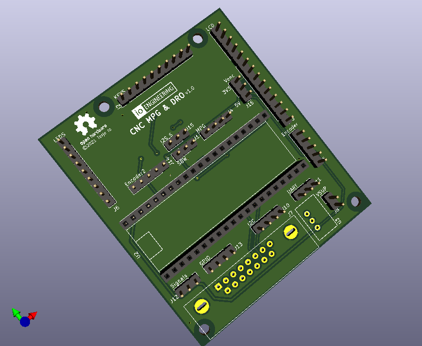
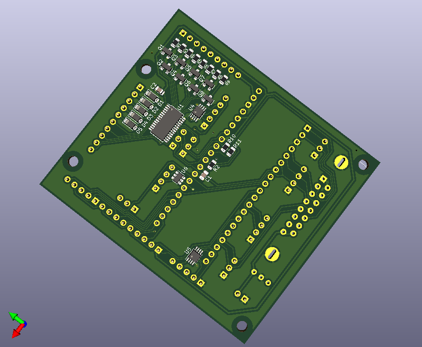

## GRBL MPG & DRO BoosterPack for Tiva C \(TM4C123G\)

__2021-08-30: Pi Pico breakout board design__

First batch of boards \(for final design verification\) to be ordered soon.

__2021-05-01: HALification of the code is underway__

A RP2040 driver for [Pi Pico](https://www.raspberrypi.org/products/raspberry-pi-pico/) is nearing completion, watch this space.

__2019-08-20: Improved startup sequence__

The GPIO line used for signalling MPG mode change is now used to signal the grbl controller ready state during startup.

On a cold start the Grbl microcontroller should pull the line low as early in the process as possible.
When the cold start sequence is completed and grbl is ready to receive data the line should be reverted to input mode with interrupt and pullup enabled.
The MPG microcontroller will wait for the line going high before starting any communication, displaying a progress indicator in its boot screen while waiting.

---

Features:

* SPI LCD and touch interface
* Up to two MPG wheels (QEI connected)
* Four GPIO pins, one is preassigned for switching grbl to/from MPG mode
* Up to 8 LEDs, buffered open drain 
* Feed Hold and Cycle Start outputs, open drain
* Up to 25 keys (in matrix)
* Navigator interface
* I2C port (3V3)
* On board MSP430G2553 handling keys and LEDs, internal I2C interface to Tiva C

Parts of alpha-version of supporting code is now available.
An initial commit of the [display driver](https://github.com/terjeio/Display-libraries/) used has now been made public.
The code is written so it is should be easy to port, all processor dependent code is in separate files. 

All core funtionality is now up and running, GUI is 100% event driven making it easy to extend with new dialogs. Shared dialogs (canvases) created for common data (such as DOC, feed rate, RPM), input review/confirmation and GCode transfer to grbl.

### How it works

The setup comprises 3 microcontrollers: one running Grbl, one handling the keyboard scanning and one (the MPG processor) for the DRO and MPG \(user interface\).

#### Grbl/grblHAL microcontroller:

Support for a second input stream and a switch for changing to/from MPG mode has to be added to the code.
In \"normal\" mode the MPG processor listen to the output stream from Grbl, parses the data and displays relevant info on the display.
In \"MPG\" mode Grbl switches its serial input to the second input stream and the MPG prosessor takes over control by acting as a GCode sender.
To tell the MPG processor about a mode change the real time report from Grbl is extended with |MPG:0 \(\"normal\"\) and |MPG:1 \(\"MPG\"\), this is only added when the mode change takes place.
Some of my [grblHAL drivers](https://github.com/grblHAL) supports this functionality as does my [patched version of grbl-Mega](https://github.com/terjeio/grbl-Mega).
 
#### MPG microcontroller:

This handles the user interface \(keypresses, MPG input, menu navigator input and DRO display\). In \"normal\" mode it passively listen to the output stream coming from Grbl, parses it and updates the display and LED statuses accordingly.
For this to work correctly there has to be a PC based GCode sender connected to the controller, such as [ioSender](https://github.com/terjeio/ioSender), that constantly request the real time status report.

In \"MPG\" mode it takes over control and acts as a GCode sender itself, ideally the PC based GCode sender should then disable its GUI.
When turning the MPG wheels G1 commands are issued with a feed rate that is dependent on the turning speed, simulating the action of the handwheels on the lathe.
The jog buttons issues jog commands and most of the other buttons issues real-time commands such as Hold or Cycle start. It is also possible to hardwire some of the button states to the corresponding Grbl input signals.

For the lathe version I am currently working on I am adding canvases \(or dialogs\) that will be used for some simple tasks such as reducing the diameter of the stock, and possibly threading if the Grbl version supports that.
There is a common canvas for streaming task data, this may be used to stream data from a SD card \(not yet implemented\). 

#### Keyboard handling microcontroller:

Due to limited IO on the MPG microcontroller a separate processor is employed for handling the keyboard and LEDs.
Up to 25 keys can be added (in a matrix) and 8 LEDs are supported. Keypresses are sent to the MPG controller via I2C, and there is a strobe signal for telling MPG controller that a key is pressed.
The strobe signal suppports different key modes such as single shot, autorepeat and continuous - configurable per key.

---

### Pi Pico breakout board

 

 

---
2021-08-30
