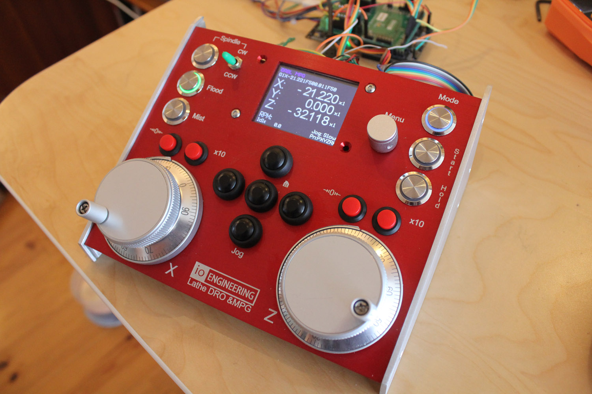

## GRBL MPG & DRO BoosterPack for Tiva C \(TM4C123G\)

__2021-05-01: HALification of the code is underway__

A RP2040 driver for [Pi Pico](https://www.raspberrypi.org/products/raspberry-pi-pico/) is nearing completion, watch this space.

__2019-08-20: Improved startup sequence__

The GPIO line used for signalling MPG mode change is now used to signal the grbl controller ready state during startup.

On a cold start the Grbl microcontroller should pull the line low as early in the process as possible.
When the cold start sequence is completed and grbl is ready to receive data the line should be reverted to input mode with interrupt and pullup enabled.
The MPG microcontroller will wait for the line going high before starting any communication, displaying a progress indicator in its boot screen while waiting.

---

Features:

* SPI LCD and touch interface
* Up to two MPG wheels (QEI connected)
* Four GPIO pins, one is preassigned for switching grbl to/from MPG mode
* Up to 8 LEDs, buffered open drain 
* Feed Hold and Cycle Start outputs, open drain
* Up to 25 keys (in matrix)
* Navigator interface
* I2C port (3V3)
* On board MSP430G2553 handling keys and LEDs, internal I2C interface to Tiva C

Parts of alpha-version of supporting code is now available.
An initial commit of the [display driver](https://github.com/terjeio/Display-libraries/) used has now been made public.
The code is written so it is should be easy to port, all processor dependent code is in separate files. 

All core funtionality is now up and running, GUI is 100% event driven making it easy to extend with new dialogs. Shared dialogs (canvases) created for common data (such as DOC, feed rate, RPM), input review/confirmation and GCode transfer to grbl.


### How it works:

The setup comprises 3 microcontrollers: one running Grbl, one handling the keyboard scanning and one (the MPG processor) for the DRO and MPG \(user interface\).

#### Grbl/grblHAL microcontroller:

Support for a second input stream and a switch for changing to/from MPG mode has to be added to the code.
In \"normal\" mode the MPG processor listen to the output stream from Grbl, parses the data and displays relevant info on the display.
In \"MPG\" mode Grbl switches its serial input to the second input stream and the MPG prosessor takes over control by acting as a GCode sender.
To tell the MPG processor about a mode change the real time report from Grbl is extended with |MPG:0 \(\"normal\"\) and |MPG:1 \(\"MPG\"\), this is only added when the mode change takes place.
Some of my [grblHAL drivers](https://github.com/grblHAL) supports this functionality as does my [patched version of grbl-Mega](https://github.com/terjeio/grbl-Mega).
 
#### MPG microcontroller:

This handles the user interface \(keypresses, MPG input, menu navigator input and DRO display\). In \"normal\" mode it passively listen to the output stream coming from Grbl, parses it and updates the display and LED statuses accordingly.
For this to work correctly there has to be a PC based GCode sender connected to the controller, such as [ioSender](https://github.com/terjeio/ioSender), that constantly request the real time status report.

In \"MPG\" mode it takes over control and acts as a GCode sender itself, ideally the PC based GCode sender should then disable its GUI.
When turning the MPG wheels G1 commands are issued with a feed rate that is dependent on the turning speed, simulating the action of the handwheels on the lathe.
The jog buttons issues jog commands and most of the other buttons issues real-time commands such as Hold or Cycle start. It is also possible to hardwire some of the button states to the corresponding Grbl input signals.

For the lathe version I am currently working on I am adding canvases \(or dialogs\) that will be used for some simple tasks such as reducing the diameter of the stock, and possibly threading if the Grbl version supports that.
There is a common canvas for streaming task data, this may be used to stream data from a SD card \(not yet implemented\). 

#### Keyboard handling microcontroller:

Due to limited IO on the MPG microcontroller a separate processor is employed for handling the keyboard and LEDs.
Up to 25 keys can be added (in a matrix) and 8 LEDs are supported. Keypresses are sent to the MPG controller via I2C, and there is a strobe signal for telling MPG controller that a key is pressed.
The strobe signal suppports different key modes such as single shot, autorepeat and continuous - configurable per key.

---


 
#### LaunchPad pin assignments:

``` plain
                   3v3 [] [] VBUS (P14.1)                             PF2 [] [] GND
                   PB5 [] [] GND                         GPIO1 (P2.4) PF3 [] [] PB2 GPIO3 (P2.2)
    UART RX (P3.3) PB0 [] [] PD0 I2SCL (P10.3)           GPIO2 (P2.3) PB3 [] [] PE0 Cycle start (P8.2)
    UART TX (P3.2) PB1 [] [] PD1 I2SDA (P10.3)          Keypad strobe PC4 [] [] PF0 QEI0 (P6.3)
                   PE4 [] [] PD2 GPIO6 (P10.4)          QEI1 A (P9.3) PC5 [] [] RST
                   PE5 [] [] PD3 DISPLAY CS (P13.7)     QEI1 B (P9.2) PC6 [] [] PB7 MOSI (P13.4, P12.3?)
SCK (P12.5, P13.3) PB4 [] [] PE1 Feed hold (P8.3) Navigator SW (P5.4) PC7 [] [] PB6 SIMO (P13.1, P12.2?)
       D/C (P13.5) PA5 [] [] PE2 TOUCH CS (P12.4)   Navigator+ (P5.3) PD6 [] [] PA4
            I2CSCL PA6 [] [] PE3 TOUCH IRQ (P12.1)  Navigator- (P5.2) PD7 [] [] PA3
            I2CSDA PA7 [] [] PF1 QEI0 B (P6.2)           RESET (P13.6)PF4 [] [] PA2

GND: P2.1, P3.1, P5.1, P8.1, P10.1, P13.8
3V3: P5.5, P6.5, P9.4, P13.2, P13.9
 
```

---

#### Tiva connected socket/pins:

GPIO \(P2\):

```
GND   GND P2.1
GPIO3 PB2 P2.2
GPIO2 PB3 P2.3
GPIO1 PF3 P2.4
```

UART \(P3\):

```
GND GND P3.1
TX  PB1 P3.2
RX  PB0 P3.3
```

Navigator \(P5\):

```
GND GND P5.1
-   PD7 P5.2
+   PD6 P5.3
SW  PC7 P5.4
```

MPG0 \(P6)\:

```
GND GND P6.1
+   PF1 P6.2
-   PF0 P6.3
3V3 3V3 P6.4
```

Signals, open drain \(P8\):

```
GND         GND P8.1
Cycle Start PE0 P8.2
Feed Hold   PE1 P8.3
```

MPG0 \(P9\):

```
GND GND P9.1
+   PC6 P9.2
-   PC7 P9.3
3V3 3V3 P9.4
```

I2C \(P10\):

```
GND GND P10.1
SDA PD1 P10.2
SCL PD0 P10.3
IRQ PD2 P10.4
NC  --- P10.5
```

LCD Touch Sensor \(P12\):

```
T_IRQ PE3 P12.1
T_DO  PB7 P12.2 (MISO)
T_DIN PB6 P12.3 (MOSI)
T_CS  PE2 P12.4
T_CLK PB4 P12.5
```

LCD Display (P13):

```
SDO   PB6 P13.1 (MISO)
LED   3v3 P13.2
SCK   PB4 P13.3
SDI   PB7 P13.4 (MOSI)
D/C   PA5 P13.5
RESET PF4 P13.6
CS    PD3 P13.7
GND   GND P13.8
VCC   3V3 P13.9
```

---

#### MSP430G2553 connected socket/pins:

Keypad matrix interface \(P11\):

```
ROW0 P11.1  P1.0
ROW1 P11.2  P1.1
ROW2 P11.3  P1.2
ROW3 P11.4  P1.3
ROW4 P11.5  P1.4
COL0 P11.6  P2.0
COL1 P11.7  P2.1
COL2 P11.8  P2.2
COL3 P11.9  P2.3
COL4 P11.10 P2.4
```

LEDs, open drain \(P14\):

```
LED0 P14.8 P3.0
LED1 P14.9 P3.1
LED2 P14.7 P3.2
LED3 P14.6 P3.3
LED4 P14.5 P3.4
LED5 P14.4 P3.5
LED6 P14.3 P3.6
LED7 P14.2 P3.7
+5V  P14.1
```

SWD - MSP430 programming interface \(P4\):

```
GND  P4.1
TEST P4.2
RST  P4.3
```

---

#### Internal keypad interface to Tiva MCU:

```
P1.6 I2CSCL        PA6
P1.7 I2CSDA        PA7
P2.5 Keypad strobe PC4
```

---
